# Agent Skills Library

A curated collection of modular, production-tested agent skills and workflows designed for pair programming with AI agents. 

Built for compatibility across modern AI coding agent harnesses, including **Google Antigravity CLI**, **Claude Code**, **OpenCode**, and other standard Agent Skills runners.

---

## 🧭 Logical Skill Suites

### 1. Project Lifecycle Suite

The **Project Lifecycle Suite** provides a structured, verifiable 7-stage workflow for taking ideas from initial concept to completed, tested code in any repository:

```mermaid
flowchart LR
    A["init-project<br/>(Scaffold & Tracker)"] --> B["review-project<br/>(Scope & Decisions)"]
    B --> C["tech-design<br/>(Traceability Matrix)"]
    C --> D["plan-effort<br/>(Vertical WEs & Flags)"]
    D --> E["execute-effort<br/>(Worktrees & Tests)"]
    E --> F["review-effort<br/>(Verify, Merge & Unblock)"]
    F -.->|Next unblocked WE| E
    F -->|All WEs complete| G["complete-project<br/>(Audit, Flags & Release)"]
```



| Stage | Skill | Description | Primary Output |
| :--- | :--- | :--- | :--- |
| **01** | [`init-project`](skills/init-project/SKILL.md) | Scaffolds a project in `docs/projects/<name>`, validates kebab-case, and configures an issue tracker (`github` or `local`). | `project.yml`, `brief.md`, `requirements.md` |
| **02** | [`review-project`](skills/review-project/SKILL.md) | Conducts a product-focused stakeholder review, scans codebase for collisions, deflects technical drift, and logs decisions. | Updated brief/requirements, `decisions.md` |
| **03** | [`tech-design`](skills/tech-design/SKILL.md) | Reads real source code to produce a technical design with an explicit Requirements Traceability Matrix; supports iterative updates. | `technical-design.md`, resolved tech questions |
| **04** | [`plan-effort`](skills/plan-effort/SKILL.md) | Decomposes architecture into vertical, independently shippable work efforts (`WE-{NN}` ~1 day), feature flags, and DAG plan. | `implementation-plan.md`, `WE-{NN}` files/issues |
| **05** | [`execute-effort`](skills/execute-effort/SKILL.md) | Implements an individual effort in an isolated git worktree (`.worktrees/`), verifies automated tests/builds, and commits. | Clean commit, `review_ready` branch/PR |
| **06** | [`review-effort`](skills/review-effort/SKILL.md) | Pre-checks remote PR status (`gh pr list`), conducts two-axis verification, squash-merges or fast-forwards base branch, removes worktree, and announces unblocked WEs. | Merged/fast-forwarded branch, cleaned worktree, unblocked WEs |
| **07** | [`complete-project`](skills/complete-project/SKILL.md) | Final scope reconciliation, feature flag disposition (canary/retire), workspace hygiene, and changelog/release notes. | `summary.md`, `project.yml` (`completed`) |

---

## 📦 Installation & Setup

### Quick Install (`install.sh`)

Clone this repository and run the included installer:

```bash
# Clone the repository
git clone https://github.com/<your-username>/skills.git ~/repos/skills
cd ~/repos/skills

# Install globally to all supported harnesses via symlinks (recommended for live editing)
./scripts/install.sh --harness all --global --link
```

### Installation by Harness

#### Google Antigravity CLI
- **Global**: Symlink or copy skills to `~/.gemini/config/skills/`:
  ```bash
  ./scripts/install.sh --harness antigravity --global --link
  ```
- **Project-Specific**: Symlink or copy skills to `.agents/skills/` in your project root:
  ```bash
  ./scripts/install.sh --harness antigravity --local --copy
  ```

#### Claude Code
- **Global**: Symlink or copy skills to `~/.claude/skills/`:
  ```bash
  ./scripts/install.sh --harness claude --global --link
  ```
- **Project-Specific**: Symlink or copy skills to `.claude/skills/` in your project root.

#### OpenCode
- **Global**: Symlink or copy skills to `~/.opencode/skills/`:
  ```bash
  ./scripts/install.sh --harness opencode --global --link
  ```

---

## 🛠️ Repository Architecture

This repository uses the universal flat `skills/<skill-name>/` structure so that all agent harnesses can discover and mount skills without translation layers:

```text
skills/
├── plugin.json               # Antigravity & OpenCode plugin manifest
├── rules/
│   └── AGENTS.md             # Shared agent guidance on project workflows
├── scripts/
│   └── install.sh            # Multi-harness installer script
└── skills/                   # Universal flat skills directory
    ├── init-project/
    ├── review-project/
    ├── tech-design/
    ├── plan-effort/
    ├── execute-effort/
    ├── review-effort/
    └── complete-project/
```

---

## 🤝 Philosophy & Adding Skills

These skills represent battle-tested agent workflows. If you find them useful in your own projects, feel free to fork, adapt, and extend them.

To add a new skill to this library:
1. Create a new directory under `skills/<your-skill-name>/`.
2. Add a `SKILL.md` with YAML frontmatter (`name`, `description`, and optional `disable-model-invocation: true`).
3. Add any templates or reference rubrics in `templates/` and `references/` subdirectories.
4. Run `./scripts/install.sh --link` to make the new skill instantly active across your agent environments.
