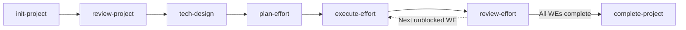

# Project Lifecycle Workflow Guidelines

When managing, designing, or implementing projects and features in repositories that use this skill suite, follow the structured 7-stage project lifecycle:

---

## The 7-Stage Lifecycle

1. **Initialize Project (`init-project`)**:
   - Creates a scoped project workspace under `docs/projects/<project-name>/`.
   - Generates `project.yml`, `brief.md`, and `requirements.md`.
   - Configures the project's issue tracker (`github` Issues via `gh` CLI or `local` markdown files in `efforts/`).
   - Aborts safely if the project directory already exists.

2. **Product Review (`review-project`)**:
   - Performs a product-focused review of `brief.md` and `requirements.md`.
   - Scans the existing codebase to map collisions, touched systems, and breaking changes.
   - Interviews stakeholders in rounds using the grilling protocol to surface contradictions and tighten scope.
   - Strictly deflects technical architecture questions into an *"Open Questions for Tech Design"* section.
   - Logs settled decisions in `docs/projects/<project-name>/decisions.md`.

3. **Technical Design (`tech-design`)**:
   - Reads actual source code and existing tests to ground all architectural choices.
   - Resolves all staged items from *"Open Questions for Tech Design"*.
   - Generates `technical-design.md` containing an explicit Requirements Traceability Matrix mapping every requirement to concrete file changes.
   - Supports incremental update passes as code evolves or new edge cases arise.

4. **Plan Work Efforts (`plan-effort`)**:
   - Decomposes `technical-design.md` into vertical, independently shippable work efforts (`WE-{NN}`) targeting ~1 day of effort.
   - Identifies feature flags for post-MVP or risky production paths.
   - Builds a dependency graph (DAG) keeping paths wide and parallelizable.
   - Establishes a local `implementation-plan.md` tracking hub and creates efforts in the configured issue tracker.

5. **Execute Work Effort (`execute-effort`)**:
   - Implements a single work effort in an isolated git worktree under `.worktrees/<project-name>-<effort-id>`.
   - Works through the effort checklist and executes automated test/build suites to verify all acceptance criteria.
   - Produces a structured commit and marks the effort `review_ready`.

6. **Review Work Effort (`review-effort`)**:
   - Pre-checks remote PR status (`gh pr list --state merged / open`) to prevent base branch divergence on `develop` or `main`.
   - Conducts a two-axis review: spec traceability against the diff and automated test suite execution.
   - Offers immediate patching or formal change requests.
   - Squash-merges or fast-forwards the verified branch from origin, removes the isolated worktree, updates tracker status to `completed`, and announces newly unblocked downstream efforts.

7. **Complete Project (`complete-project`)**:
   - Reconciles delivered efforts against initial requirements (allowing formal deferrals with logged decisions).
   - Audits feature flags for monitoring, enabling by default, or retirement.
   - Prunes lingering worktrees and branches.
   - Writes `summary.md` with release notes and marks `project.yml` as `completed`.
